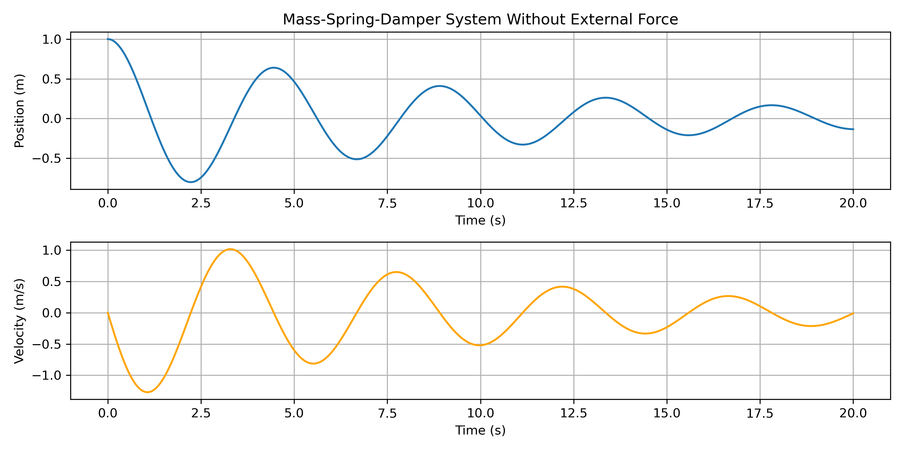
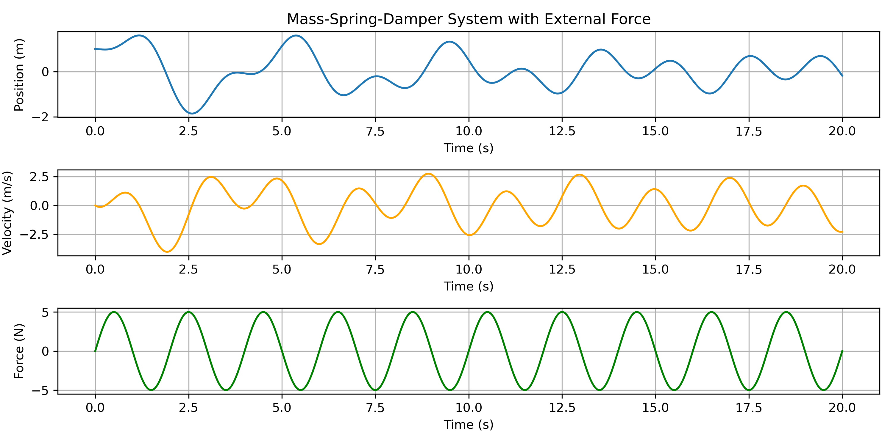

# Dynamic System Simulation with Python

This note presents the modeling process of a simple 1D dynamic system using
Python, which is very like the Project 2 in this course, but a simpler
version. Thus, **if you find Project 2 to be challenging, understanding
the 1D example in this note will be very beneficial.**

## Background

The mass-spring-damper system is a fundamental model in mechanical
engineering and physics that describes the behavior of many mechanical 
systems. According to the [Wikipedia model](
    https://en.wikipedia.org/wiki/Mass-spring-damper_model), 
this system is governed by a second-order ordinary differential 
equation (ODE).

### Mathematical Model

The system follows the equation:

$$
m\ddot{x}(t) + c\dot{x}(t) + kx(t) = F(t)
$$

Where:
- $m$ = mass (kg)
- $c$ = damping coefficient (N·s/m)
- $k$ = spring constant (N/m)
- $F(t)$ = external force (N)
- $x(t)$ = position (m)
- $\dot{x}(t)$ = velocity (m/s)
- $\ddot{x}(t)$ = acceleration (m/s²)

### Physical Interpretation
- **Spring force**: $-kx$ (restoring force proportional to 
displacement)
- **Damper force**: $-c\dot{x}$ (dissipative force proportional to 
velocity)
- **External force**: $F(t)$ (driving force applied to the system)

## Methodology

### Numerical Solution Approach

We solve this second-order ODE by converting it to a system of first-order ODEs using state-space representation:

$$
\begin{aligned}
\frac{dx}{dt} &= v \\
\frac{dv}{dt} &= \frac{F(t) - cv - kx}{m}
\end{aligned}
$$

We use `scipy.integrate.solve_ivp` with the Runge-Kutta method for numerical integration.

### Implementation Code

```python
"""
Mass-Spring-Damper System Simulation

This script simulates the behavior of a mass-spring-damper system as 
described in the Wikipedia page: 
    https://en.wikipedia.org/wiki/wiki/Mass-spring-damper_model
"""

import numpy as np
import matplotlib.pyplot as plt
from scipy.integrate import solve_ivp

def mass_spring_damper(t, y, mass, damping, stiffness,
                       external_force=None):
    """
    Defines the system of differential equations for a 
    mass-spring-damper system.
    
    Parameters:
        t : float - Current time (s)
        y : list - State vector [position, velocity] (m, m/s)
        mass : float - Mass (kg)
        damping : float - Damping coefficient (N·s/m)
        stiffness : float - Spring constant (N/m)
        external_force : None, or callable - External force function F(t)
    
    Returns:
        list - Derivatives [velocity, acceleration]
    """
    position, velocity = y

    force = 0.0
    if external_force is not None:
        force = external_force(t)

    # Convert second-order ODE to system of first-order ODEs:
    # dx/dt = velocity
    # dv/dt = (F(t) - damping*velocity - stiffness*position) / mass
    dydt = [velocity, 
            (force - damping * velocity - stiffness * position) / mass]

    return dydt


def simulate_system(initial_position, initial_velocity, t_span, 
                    t_eval=None, external_force=None,
                    method='RK45'):
    """
    Simulates the mass-spring-damper system.
    
    Parameters:
        initial_position : float - Initial position (m)
        initial_velocity : float - Initial velocity (m/s)
        t_span : tuple - Time range (start, end) in seconds
        t_eval : array - Specific time points for evaluation
        external_force : callable - External force function
        method: Integration method (e.g., 'RK45', 'RK23', 'BDF').
    
    Returns:
        tuple - (time, position, velocity) arrays
    """
    
    initial_conditions = [initial_position, initial_velocity]

    solution = solve_ivp(
        mass_spring_damper, t_span, initial_conditions, 
        t_eval=t_eval, 
        args=(mass, damping, stiffness, external_force),
        method=method)
    
    return solution.t, solution.y[0], solution.y[1]
```

### Simulation Setup

```python
# Example usage
if __name__ == "__main__":
    # System parameters
    mass = 1.0           # Mass of the object (kg)
    damping = 0.2        # Damping coefficient (N·s/m)
    stiffness = 2.0      # Spring constant (N/m)
    
    # Time parameters
    t_span = (0, 20)     # 20-second simulation
    t_eval = np.linspace(
        t_span[0], t_span[1], 500)  # High resolution for smooth plots

    # Initial conditions
    initial_position = 1.0  # 1 meter initial displacement
    initial_velocity = 0.0  # Released from rest

    ####################################################################
    # Case 1: Free vibration (no external force)
    t, position, velocity = simulate_system(
        initial_position, initial_velocity, t_span, t_eval)

    ####################################################################
    # Case 2: Forced vibration with sinusoidal external force
    def external_force(t):
        """Sinusoidal force: F(t) = 5.0 * sin(2π*0.5*t)"""
        return 5.0 * np.sin(2.0 * np.pi * 0.5 * t)
    
    t_forced, position_forced, velocity_forced = simulate_system(
        initial_position, initial_velocity, t_span, t_eval,
        external_force=external_force)
```

## Results and Analysis

### Case 1: Free Vibration

**System Parameters:**
- Mass ($m$): 1.0 kg
- Damping ($c$): 0.2 N·s/m  
- Stiffness ($k$): 2.0 N/m
- Initial displacement: 1.0 m
- Initial velocity: 0.0 m/s

**Expected Behavior:**
- Natural frequency: $\omega_n = \sqrt{\frac{k}{m}} = \sqrt{2} \approx 1.414$ rad/s
- Damping ratio: $\zeta = \frac{c}{2\sqrt{mk}} = \frac{0.2}{2\sqrt{2}} \approx 0.071$ (underdamped)
- The system should exhibit oscillatory behavior with exponential decay

**Observations:**
If you plot out the results of Case 1, it will be like the following:



From the result we can observe:
- The position plot shows decaying oscillations
- The velocity leads the position by 90 degrees phase
- Amplitude decreases exponentially due to energy dissipation in the damper
- System exhibits underdamped behavior characteristic of $\zeta < 1$

### Case 2: Forced Vibration

**External Force:**

$$ 
F(t) = 5.0 \cdot \sin(2\pi \cdot 0.5 \cdot t) = 5.0 \cdot \sin(\pi t) 
$$

- Amplitude: 5.0 N
- Frequency: 0.5 Hz ($\omega = \pi$ rad/s)

If you plot out the results of Case 2, it will be like the following:



**Analysis:**
- Driving frequency (0.5 Hz) is different from natural frequency ($\approx 0.225$ Hz)
- System shows combined transient and steady-state response
- Initially dominated by natural frequency response
- Eventually synchronizes with driving frequency
- Steady-state amplitude determined by frequency response characteristics

### Key Physical Insights

1. **Energy Conservation**: In free vibration, mechanical energy 
converts between potential ($\frac{1}{2}kx^2$) and kinetic (
$\frac{1}{2}m\dot{x}^2$) forms, with gradual dissipation through damping.

2. **Resonance**: If the driving frequency matched the natural 
frequency $\omega = \omega_n$, we would observe resonance with much larger amplitudes.

3. **Phase Relationships**: 
   - Velocity leads position by$ 90^\circ$
   - Acceleration leads velocity by $90^\circ$
   - In forced vibration, the phase between force and response depends on frequency ratio $\frac{\omega}{\omega_n}$

4. **Damping Effects**:
   - Critical damping ($\zeta = 1$): No oscillations, fastest return to equilibrium
   - Underdamping ($\zeta < 1$): Oscillatory decay (our case)
   - Overdamping ($\zeta > 1$): Slow non-oscillatory return

## Conclusion

The mass-spring-damper simulation successfully demonstrates:
- ✅ Accurate implementation of the physical model
- ✅ Clear visualization of both free and forced vibration
- ✅ Proper handling of initial conditions and external forcing
- ✅ Physically realistic behavior matching theoretical predictions

This simulation provides valuable insights into dynamic system behavior 
and serves as a foundation for more complex mechanical system analyses.

---

*Note: This analysis uses numerical methods to solve the differential 
equations, providing approximate solutions that closely match 
theoretical predictions for well-behaved systems.*
