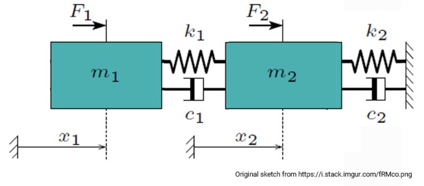

# Project 2 in 46W38
This is the second programming project of 46W38, which will be graded. Passing this project is one of the three requirements for passing this course. The other two requirements are passing programming project 1 and 3.

**Due date of Project 2: 2025-Nov-2, 11:59 PM**

# Turbie

For this project, you will be building and simulating Turbie. Turbie is a simple, two-degree-of-freedom (2DOF) system based of the DTU 10 MW Reference Wind Turbine. She is equivalent to the forced 2DOF mass-spring-damper system shown below, which is defined by a mass matrix, stiffness matrix, and damping matrix.

## Mass, Stiffness and Damping Matrices

To derive Turbie’s mass, stiffness and damping matrices, we make a few assumptions about our dynamical system:
* The turbine can only move in the fore-aft direction;
* The 3 blade deflections in the fore-aft direction are syncronized, i.e., only collective flapwise deflections.

With these assumptions, we have reduced Turbie to two degrees of freedom: the deflection of the blades in the fore-aft direction and the deflection of the nacelle in the fore-aft direction. The 2 DOFs of the system are therefore defined as:
* the deflection of the blades from their undeflected position in the global coordinate system;
* the deflection of the nacelle from its undeflected position in the global coordinate system.

With these DOFs, Turbie is equivalent to a 2DOF mass-spring-damper system, as shown above, where Mass 1 represents the 3 blades and Mass 2 represents the combined effects of the nacelle, hub and tower.

We can define the 2DOF mass-spring-damper system with the following system matrices:

$$
\mathbf{M} =
\begin{bmatrix}
m_1 & 0 \\
0 & m_2
\end{bmatrix}
$$

$$
\mathbf{C} =
\begin{bmatrix}
c_1 & -c_1 \\
-c_1 & c_1 + c_2
\end{bmatrix}
$$

$$
\mathbf{K} =
\begin{bmatrix}
k_1 & -k_1 \\
-k_1 & k_1 + k_2
\end{bmatrix}
$$

Here is a table of relevant parameter values for Turbie. These values are held in the **turbie_parameters.txt** file

| Symbol        | Description                                  | Value              |
|---------------|--------------------------------------------- |--------------------|
| $m_b$         | Mass of a single blade                       | 41 metric tons     |
| $m_n$         | Mass of the nacelle                          | 446 metric tons    |
| $m_t$        | Mass of the tower                            | 628 metric tons    |
| $m_h$        | Mass of the hub                              | 105 metric tons    |
| $c_1$        | Equivalent damping of the blades             | 4208 N/(m/s)       |
| $c_2$        | Equivalent damping of the nacelle, hub, tower| 12730 N/(m/s)      |
| $k_1$        | Equivalent stiffness of the blades           | 1711000 N/m        |
| $k_2$        | Equivalent stiffness of the nacelle, hub, tower | 3278000 N/m     |
| $D_{\text{rotor}}$ | Rotor diameter                         | 180 m              |
| $\rho$       | Air density                                  | 1.22 kg/m $^3$     |

# Dynamical Equations
A wind turbine is, as you might expect, forced by the wind. To accurately model aerodynamics, you should include extra time-dependent variables to include phenomena such as dynamic stall, tower shadow, variable turbine speed, etc. For simplicity, we make the following assumptions:
* No dynamic inflow, dynamic stall, or tower shadow;
* Turbie’s thrust coefficient is constant for a simulation and can be calculated from the mean wind speed;
* The only aerodynamic forcing is on the blades;
* No spatial variation of turbulence.

With these assumptions, the aerodynamic forcing on the blades is given by:

$$
f_{aero}(t) = \tfrac{1}{2} \rho C_T A \cdot \big(u(t) - \dot{x}_1\big) \cdot \big|u(t) - \dot{x}_1\big|,
$$

where $A$ is the rotor area and $u(t)$ is the wind speed at time $t$. The thrust coefficient $C_T$ is determined from the mean wind speed $U = u(t)$ using the look-up table defined in **C_T.txt**.

The full dynamical equations for Turbie are then given by

$$
\textbf{M} \ddot{\bar{x}}(t) + \textbf{C} \dot{\bar{x}}(t) + \textbf{K} \bar{x}(t) = \bar{F}(t),
$$

where $\bar{x}(t) = [x_1(t), x_2(t)]^T$ is the state vector, and the forcing vector is given by

$$
\bar{F}(t) =
\begin{bmatrix}
f_{aero}(t) \\
0
\end{bmatrix}.
$$

# Simulating Turbie
By simulating Turbie's response to wind loads, the derivatives of the blade and tower deflections and their velocities at each time step can be determined and captured in the vector $\bar{y}'(t)$. To solve for a time-marching response, you will need to use a numerical integrator that can solve dynamical systems of the form:

$$
\bar{y}'(t) = f(t, \bar{y})
$$

Let’s consider our dynamical system of the form

$$
\mathbf{M}\ddot{\bar{x}}(t) + \mathbf{C}\dot{\bar{x}}(t) + \mathbf{K}\bar{x}(t) = \bar{F}(t),
$$

and define a new vector $\bar{y}(t) = [\bar{x}(t), \dot{\bar{x}}(t)]^T$, called a state vector. This vector is 4 elements long for Turbie because it contains both the displacements and the velocities for the blades and tower. In this case, it can be shown that:

$$
{\bar{y}}'(t) =
\begin{bmatrix}
[0]_{N \times N} & [I]_{N \times N} \\
-\mathbf{M}^{-1}\mathbf{K} & -\mathbf{M}^{-1}\mathbf{C}
\end{bmatrix}
\bar{y}(t) + 
\begin{bmatrix}
0 
\\ 
-\mathbf{M}^{-1}\bar{F}(t)
\end{bmatrix},
$$

where $N$ is the number of degrees of freedom. For Turbie, $N = 2$. We can simplify this expression as

$$
\bar{y}'(t) = \mathbf{A}\bar{y}(t) + \mathbf{B}(t)
$$

where $\mathbf{A}$ is the system matrix, encoding the mass, stiffness and damping, and $\mathbf{B}$ is the input matrix, capturing the forcing from the wind.

If you have a function that calculates the derivative of your dynamical system, in this case $\bar{y}'(t)$, then you can use a numerical solver such as `scipy.integrate.solve_ivp` within Python to simulate the system.

# The Programming Task
Your task for this project is to build a Turbie module within Python housing the equations required to simulate the system. Then, you can import the module and its functions into another Python script. You will then apply the provided wind files to the model to determine how the blade and tower deflections vary with the wind speed and turbulence itensity (TI).

The functions within the Turbie module should enable the:
* Importing of the wind file data;
* Determination of the $C_T$ for each **wind speed simulation** based on the **average wind speed**, via interpolation with the wind speed vs. $C_T$ look-up table found in C_T.txt;
* Building of the Turbie system matrices ($\mathbf{M}$, $\mathbf{K}$ and $\mathbf{C}$) based on the values within the turbie_parameters.txt;
* Calculation of $\bar{y}'(t)$.

Within your second Python script, you should call upon these functions to solve Turbie for each wind speed case. You should pass $\bar{y}'(t)$ as one of the arguments to the `scipy.integrate.solve_ivp` function (along with initial conditions for $y$), which should then output the blade and tower displacements and velocities of Turbie at each time step.

Your code should enable the simulation of Turbie at each wind speed case within each TI category, with results saved within a text file for each case. 

- For one of the wind speed cases, plot the relative time-marching variation of wind and the blade and tower displacements.

The means and standard deviations of the blade and tower displacements for each wind speed should then be calculated and saved within a separate text file for each TI category.

- Plot the means and standard deviations of the blade and tower displacements for the wind speeds of each TI category.

- Discuss and explain how the means and standard deviations of the blade and tower displacements change with the wind speed and with the TI. 

**Hint:** To get the mean and standard deviation of the displacements for a given wind speed of a specific TI category, 
you need to first compute the time series of displacements using the
wins peed time series (like 6 m/s with 0.1 TI as stored in 
"wind_6_ms_TI_0.1.txt"), then compute the mean and standard deviation
based on the displacement time series.

**Note**: The turbine parameters and the wind data are provided in the
[turbie_inputs](turbie_inputs/) and [wind_files](wind_files/) folders. 
You can download these files and put it the corresponding folders in 
your project repository. These files should then be used in your main
script.  

# How to hand-in

Create a repository named Project02_46W38 on GitHub. The owner should be you. Note also the following:

* Add a proper description.
* Choose visibility: Public or Private. (You may choose to make it only public after you hand-in or public since the beginning.)
* Start with a template: No template.
* Add .gitignore: Python
* Add license: choose a license you want (like MIT license).
* Add README: This should also include the **discussion and explanation** of your results.
* Inside this repository, there should be:
    1. Two python scripts, one named "turbie_mod.py" (for the Turbie module) and the other named "main.py" (for the main script). 
    2. An "inputs" folder housing the inputs, with subfolders for the wind and Turbie input files. 
    3. An "outputs" folder housing the results, with subfolders for the different wind TI categories.

Write code incrementally and using Git to do version control.

When you are satisfied with your code, please send us a link of your repository before the hand-in deadline.

# Evaluation
Evaluation of the project will be solely based on the repository, with focus on:

* Functionality: does it implement the model correctly and fulfill the requirements listed in **The Programming Task** section.
* Figure presentation: are the figures clear, consitent and well presented according to good plotting practices.
* Code quality: does the code have proper efficiency, naming, docstring, comments and layout.
* Professional workflow: does the repository looks professional and has it use version control properly (like meaningful commits).
* Demonstration of understanding: have the results been discussed and explained.

# Extension (if needed)
If you need an extension, you should apply at least 5 days before the deadline, this needs to be done by email, i.e., write to Ju Feng (jufen@dtu.dk).