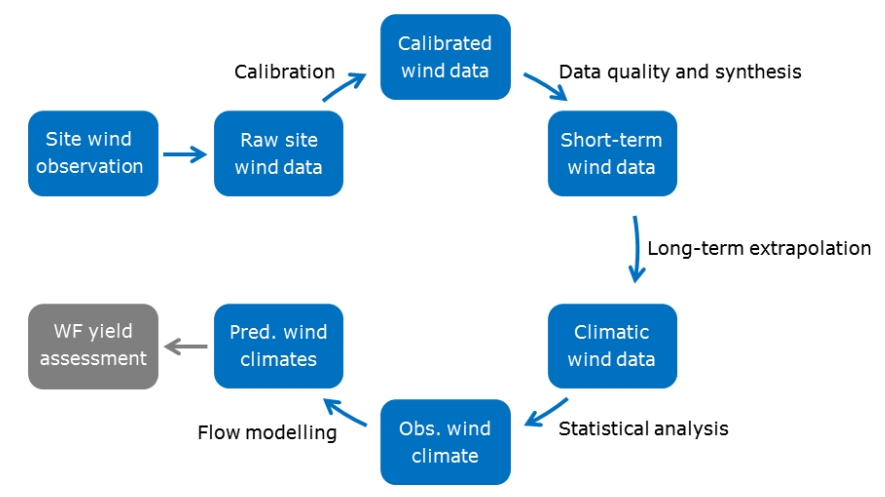

# Wind resource assessment based on reanalysis data

This is one of the three pre-defined final projects in [46W38 Scientific
Programming for Wind Energy](https://kurser.dtu.dk/course/46w38), an 
E-learning course for the 
[Master of Wind Energy – Online Programme](https://lifelonglearning.dtu.dk/en/wind-energy/master-en/master-en-master-of-wind-energy-online-programme/)
provided by DTU Wind. 

The objective of this project is to develop a Python Module for wind resource 
assessment at a specified site using ERA5 reanalysis data. Students will 
analyze multi-year hourly wind data at two heights (e.g., 10 m and 100 m) to 
estimate key wind energy metrics, including wind speed distribution, wind rose, 
annual energy production (AEP) for selected turbines. The Module will provide
tools to process, visualize, and interpret reanalysis data for use in wind 
energy project planning.


## Background
Wind resource assessment (WRA) is a foundational step in wind energy project
development, aimed at quantifying the energy potential and economic viability 
of a site. Accurate WRA ensures optimal turbine placement, maximizes energy
production, and minimizes financial risks. Traditional WRA workflows rely on
multi-year on-site measurements (e.g., from met masts or LiDAR) to characterize
wind speed, direction, shear, and turbulence. However, these measurements are
costly, spatially limited, and rarely span decades — a critical gap given the
interannual variability of wind climates.

### Typical WRA Workflow
A typical WRA workflow includes the following steps:
1. **Site Selection**: Preliminary analysis using historical data (e.g., 
reanalysis datasets, nearby weather stations) to identify regions with 
promising wind regimes.

2. **On-Site Data Collection**: Deployment of measurement devices (e.g., 
anemometers at multiple heights) for 1–3 years to capture seasonal and annual
 trends.

3. **Data Analysis**: Wind Speed Distribution: Fitting statistical models 
(e.g., Weibull distribution) to describe wind speed frequency.

4. **Wind Shear**: Estimating vertical wind speed gradients using the power 
law or logarithmic wind profile.

5. **Directional Analysis**: Assessing prevailing wind directions via wind 
roses.

6. **Temporal Extrapolation**:
Long term correction using techniques like MCP (Measure–Correlate–Predict).

7. **Spatial Extrapolation**:
Projecting wind speeds to turbine hub height and adjusting for local terrain 
effects using computational models (e.g., [WAsP](https://www.wasp.dk/)).

8. **Energy Yield Estimation**:
Combining wind data with turbine power curves to calculate Annual Energy 
Production (AEP) and uncertainty bounds.

In (Mortensen, 2018), an overview of the steps in the wind resource assessment procedure is described in the following diagram:



<div style="font-style: italic; text-align: center;">

Source: Figure 5 in (Mortensen, 2018)

</div>

### The Role of Reanalysis Data
Global reanalysis datasets like ERA5 (produced by ECMWF) blend historical 
observations with numerical weather prediction models to reconstruct 
consistent, long-term climate records. While ERA5’s spatial resolution (~30 km) 
cannot resolve microscale terrain effects, it provides valuable insights into:

* **Long-Term Trends**: Decadal wind variability and extreme wind events.

* **Vertical Profiles**: Wind speeds at multiple heights (e.g., 10 m and 100 m) 
for shear analysis.

* **Global Accessibility**: Data for remote or offshore regions lacking on-site 
measurements.

For wind energy, ERA5 is increasingly used for:

* **Preliminary Site Screening**: Identifying regions with high wind potential 
before deploying sensors.

* **Climate Adjustment**: Correcting short-term measurement campaigns for 
long-term climatology.

* **Uncertainty Quantification**: Comparing reanalysis data with local 
measurements to bound AEP estimates.

### Project Context
This project challenges students to automate key WRA tasks using ERA5 data,
bridging the gap between reanalysis datasets and wind energy applications. By
developing a Python module students will replicate industry-standard 
workflows(e.g., Weibull fitting, AEP calculation) while addressing the unique
challenges of reanalysis data, such as spatial averaging and vertical 
extrapolation. The results will highlight how ERA5 can supplement — or in some 
cases, streamline — traditional wind resource assessment practices.

### Methodology
Assume you have the time series of wind speed [m/s] and wind direction [deg]
from field measurement or models or reanalysis like in this project. They can 
be denoted as:

$$[u(t_1), u(t_2), ..., u(t_n)]$$

$$[\theta(t_1), \theta(t_2), ..., \theta(t_n)]$$

A Weibull distribution can be used to fit the distribution of wind speed, which
has the following form:

$$ f(u) = \frac{k}{A}(\frac{u}{A})^{(k-1)}e^{-{(u/A)}^k}$$

where $f(u)$ is the probability density function of wind speed, $A$ and 
$k$ are the Weibull scale and shape parameters. 

And we also assume the time series are available for multiple heights. Now we
want to analyze the wind resource at a specific height, which míght be 
different from the heights where wind data are available. We can then use a 
wind shear model to compute the wind at the given height, such as the power
law profile or the logarithmic profile. 

In the power law profile, the wind speed at height $z$ and the wind speed at a
reference height $z_r$ satisfies:

$$\frac{u(z)}{u(z_r)}={(\frac{z}{z_r})}^\alpha$$

where $\alpha$ is the power law exponent.

In the logarithemic law profile, the wind speed at height $z$ and the wind 
speed at a reference height $z_r$ satisfies:

$$\frac{u(z)}{u(z_r)}=\frac{\ln(z/z_0)}{\ln(z_r/z_0)}$$

where $z_0$ is the surface roughness length.

For wind direction variations over height, we can assume **the wind direction 
around and above 100 m height be the same as wind direction at 100 m height.**

Consider a wind turbine with power curve defined by $P(u)$, if the probability 
density function of wind speed at its hub height is $f(u)$, we can then 
calculate its Annual Energy Production (AEP) by:

$$AEP = \eta \cdot 8760 \cdot \int_{u_{in}}^{u_{out}}P(u)f(u)du$$

in which $\eta$ denotes the availability of the wind turbine (which we can 
assume as 1.0 in this project), 8760 represent the number of hours in one year,
$u_{in}$ and $u_{out}$ denote the cut-in and cut-out wind speeds of the turbine.


## Provided data
### Wind data
In this project, we provide the hourly time series of wind speed (u and v 
compoents) at two heights (100 m and 10 m) for four points around the Horns Rev
1 offshore wind farm in Danish waters in the North Sea. The geographic 
coordinate for Horns Rev 1 is: 55°31′47″N, 7°54′22″E (source: https://en.wikipedia.org/wiki/Horns_Rev_Offshore_Wind_Farm). You can find
more details on the Horns Rev 1 at: https://powerplants.vattenfall.com/horns-rev/.

The wind data we provide is from ERA5 and covers the period of 1997 to 2008 at
the following 4 locations:
* 55.5°N, 7.75°E
* 55.5°N, 8°E
* 55.75°N, 7.75°E
* 55.75°N, 8°E

ERA5 is the fifth generation ECMWF reanalysis for the global climate and 
weather for the past 8 decades. Data is available from 1940 onwards. 

Reanalysis combines model data with observations from across the world into a 
globally complete and consistent dataset using the laws of physics. This 
principle, called data assimilation, is based on the method used by numerical 
weather prediction centres, where every so many hours (12 hours at ECMWF) a 
previous forecast is combined with newly available observations in an optimal 
way to produce a new best estimate of the state of the atmosphere, called 
analysis, from which an updated, improved forecast is issued. Reanalysis works 
in the same way, but at reduced resolution to allow for the provision of a 
dataset spanning back several decades. Reanalysis does not have the constraint 
of issuing timely forecasts, so there is more time to collect observations, and 
when going further back in time, to allow for the ingestion of improved 
versions of the original observations, which all benefit the quality of the 
reanalysis product.

ERA5 provides hourly estimates for a large number of atmospheric, ocean-wave 
and land-surface quantities. More details on the ERA5 dataset can be found in 
(ECMWF, 2025).

We provide the wind data in multiple NetCDF4 files (.nc files) in the `inputs`
folder. The naming convention is like "XXXX-YYYY.nc", which means the wind data 
from year XXXX to year YYYY.

In these NetCDF4 data files, the following four data variables are avialable:

* **100m u-component of wind** [m/s]: This parameter is the eastward component 
of the 100 m wind. It is the horizontal speed of air moving towards the east, 
at a height of 100 metres above the surface of the Earth, in metres per second. 
Care should be taken when comparing model parameters with observations, because 
observations are often local to a particular point in space and time, rather 
than representing averages over a model grid box. This parameter can be 
combined with the northward component to give the speed and direction of the 
horizontal 100 m wind.

* **100m v-component of wind** [m/s]: This parameter is the northward component
of the 100 m wind. It is the horizontal speed of air moving towards the north, 
at a height of 100 metres above the surface of the Earth, in metres per second. 
Care should be taken when comparing model parameters with observations, because 
observations are often local to a particular point in space and time, rather 
than representing averages over a model grid box. This parameter can be 
combined with the eastward component to give the speed and direction of the
horizontal 100 m wind.

* **10m u-component of wind** [m/s]: This parameter is the eastward component
of the 10 m wind. It is the horizontal speed of air moving towards the east, 
at a height of 10 metres above the surface of the Earth, in metres per second. 
Care should be taken when comparing model parameters with observations, because 
observations are often local to a particular point in space and time, rather 
than representing averages over a model grid box. This parameter can be 
combined with the northward component to give the speed and direction of the 
horizontal 10 m wind.

* **10m v-component of wind** [m/s]: This parameter is the northward component
of the 10 m wind. It is the horizontal speed of air moving towards the north, 
at a height of 10 metres above the surface of the Earth, in metres per second. 
Care should be taken when comparing model parameters with observations, because 
observations are often local to a particular point in space and time, rather 
than representing averages over a model grid box. This parameter can be 
combined with the eastward component to give the speed and direction of the
horizontal 10 m wind.


NetCDF4 means NetCDF version 4. It is a hierarchical data format and has a 
“self-describing” data structure which means that metadata, or descriptions of 
the data, are included in the file itself and can be parsed programmatically 
meaning that they can be accessed using code to build automated and 
reproducible workflows.

You can use the [```netCDF4```](https://pypi.org/project/netCDF4/) Python 
library, or  [```xarray```](https://pypi.org/project/xarray/) Python library to
work with NetCDF4 files. Check the related official documentations to learn how
to use these tools.

### Turbine data
Power curves of two reference wind turbines (NREL 5 MW and NREL 15 MW) are 
provied in csv files. The data sources for these two files are as follows:
* **NREL 5 MW reference turbine**: https://github.com/NREL/turbine-models/blob/main/turbine_models/data/Offshore/NREL_Reference_5MW_126.csv
* **NREL 15 MW reference turbine**: https://github.com/NREL/turbine-models/blob/main/turbine_models/data/Offshore/2020ATB_NREL_Reference_15MW_240.csv

You can use the power curves to compute the time series of power output and AEP
(Annual Energy Production) for a specific turbine at the considered location 
for a given year/years. 

**Note**: the hub height of the NREL 5 MW reference turbine is **90 m**, while 
the hub height of the NREL 15 MW reference turbine is **150 m**.


## Requirements to pass
### Functional requirements
As a minimal, your module should be able to:
1. Load and parse multiple provided netCDF4 files.
2. Compute wind speed and wind direction based on u-component and v-component
of wind.
3. Compute wind speed and wind direction time series at 10 m and 100 m heights 
for a given location inside the box bounded by the four locations, such as the 
Horns Rev 1 site, using interpolation.
4. Compute wind speed time series at height $z$ for a given location inside the
box bounded by the four locations using power law profile.
5. Fit Weibull distribution for wind speed at
a given location (inside the box) and a given height.
6. Plot wind speed distribution (histogram vs. fitted Weibull distribution)  
at a given location (inside the box) and a given height.
7. Plot wind rose diagram that showes the frequencies of different wind 
direction at a given location (inside the box) and a given height.
8. Compute AEP of a specifed wind turbine (NREL 5 MW or NREL 15 MW) at a given
location inside the box for a given year in the period we have provided the
wind data.

Note that for the tasks listed in points 3-7, the functions should be able to
specify the starting year (default to be 1997) and ending year (default to be
2008), thus defining which years' data to be used.

### Formal requirements
Check the general requirements defined for all final projects.

### Other tips
* If you want to model the AEP of a wind farm with wake effects properly 
modeled, you can consider using [`PyWake`](
    https://topfarm.pages.windenergy.dtu.dk/PyWake/).

* If you want to fit a joint distribution of wind speed and wind direction to 
better characterize the wind condition, you may check the model prosed in 
(Feng and Shen, 2015).


## References
* Mortensen, N. G. (2018). *Wind resource assessment using the WAsP software*. 
DTU Wind Energy. DTU Wind Energy E No. 174 (Available at: 
https://backend.orbit.dtu.dk/ws/portalfiles/portal/164389714/Wind_resource_assessment_using_the_WAsP_software_DTU_Wind_Energy_E_0174_.pdf)

* Manwell, J.F., McGowan, J.C. and Rogers, A.L. (2009). *Wind Energy Explained: Theory, Design and Application*. 2nd edition. John Wiley & Sons

* ECMWF (2025). *ERA5 hourly data on single levels from 1940 to present*. DOI: 
[10.24381/cds.adbb2d47](https://doi.org/10.24381/cds.adbb2d47)

* Feng, J. and Shen, W.Z. (2015). Modelling wind for wind farm layout 
optimization using joint distribution of wind speed and wind direction. 
*Energies*, 8(4), pp.3075-3092. DOI: [10.3390/en8043075](
https://doi.org/10.3390/en8043075)


## Recommended materials
To learn more about the topic of this project, the following materials are
recommended:

* [**Wind Profiles**](
    https://youtu.be/Rwz0m6p7RQk) by Sven-Erik Gryning

* [**Wind resource assessment**](
    https://youtu.be/j8ps78uhY4A) by Sven-Erik Gryning