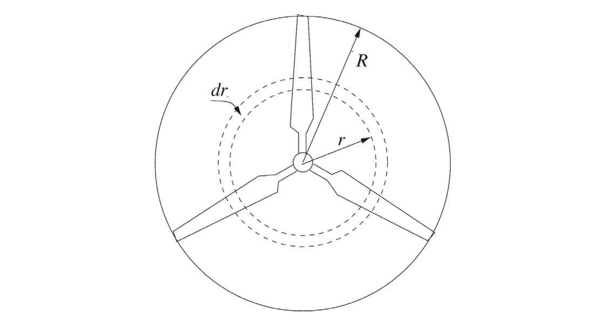

# Wind turbine modeling using Blade Element Momentum (BEM) theory
This is one of the three pre-defined final projects in [46W38 Scientific
Programming for Wind Energy](https://kurser.dtu.dk/course/46w38), an 
E-learning course for the 
[Master of Wind Energy – Online Programme](https://lifelonglearning.dtu.dk/en/wind-energy/master-en/master-en-master-of-wind-energy-online-programme/)
provided by DTU Wind. 

The objective of this project is to develop a steady-state Blade Element 
Momentum (BEM) model to predict the aerodynamic performance of a wind turbine. 
The model will compute key performance metrics such as power output, thrust, 
and torque as functions of wind speed, rotor speed, and blade pitch angle.

## Background
Blade Element Momentum (BEM) theory is the most widely used method for wind 
turbine aerodynamic modeling due to its balance between computational 
efficiency and accuracy. It combines momentum theory (global conservation of 
mass, momentum, and energy) with blade element theory (local aerodynamic forces 
on blade sections) to estimate rotor performance. BEM is critical for:

* **Design Optimization**: Evaluating blade geometry, pitch settings, and 
control strategies.

* **Power Curve Prediction**: Estimating annual energy production (AEP) under 
varying wind conditions.

* **Load Analysis**: Calculating thrust and torque for structural design.

For a more detailed introduction on the BEM theory, you are referred to the
textbook (Hansen, 2015) or the DTU MSc course [46300 Wind Turbine Technology 
and Aerodynamics](https://kurser.dtu.dk/course/2024-2025/46300?menulanguage=en).

### Typical BEM Workflow
1. **Input Parameters**:
    * Blade geometry (chord, twist, airfoil data along the span).
    * Operational conditions (wind speed, rotor speed, pitch angle).

2. **Momentum Theory**:
    Compute axial ($a$) and tangential ($a^\prime$) induction factors 
    using actuator disk theory.

3. **Blade Element Theory**:
Calculate lift and drag forces at each blade section using airfoil polars (e.g.
, $C_l$, $C_d$).

4. **Iterative Solution**:
Solve for induction factors that balance momentum and blade element equations, 
often requiring numerical iteration.

5. **Loss Corrections**:
Apply Prandtl’s tip/hub loss corrections to account for finite blade effects. 
Note that the minimal version of the code required in this project can ignore
this step.

6. **Performance Metrics**:
Integrate sectional forces to compute total power, thrust, and torque.

### Methodology
Consider a wind turbine rotor with radius $R$, we can consider a blade element
at span position $r$ with element length of $dr$, as shown in the following 
diagram:

Source: Figure 3.8 in (Hansen, 2015)

We can then calculate the local solidity $\sigma(r)$, defined as the fraction 
of the annular area in the control volume, which is covered by blades as follows:

$$\sigma(r) = \frac{c(r)B}{2\pi r}$$

where $B$ denotes the number of blades that is 3 for the turbine we considered.

Assume the local chord length at this span position is $c(r)$, the local twist
angle is $\beta(r)$, and the rotor is operated at the following conditions:
* Inflow wind speed: $V_0$
* Blade pitch angle: $\theta_p$
* Rotational speed: $\omega$

Note that given the rotor radius $R$, the inflow wind speed $V_0$ and the 
rotational speed $\omega$, the tip speed ratio $\lambda$, or TSR, is given by:

$$ 
\lambda = \frac{\omega R}{V_0}
$$ 

Based on the procedure described in Chapter 6 of (Hansen 2015), the following
steps can be taken to solve the steady BEM equations to obtain the axial 
($a$) and tangential ($a^\prime$) induction factors and compute the 
contribution of thrust and torque of this blade element:

* **Step 1**: Initialize $a$ and $a^\prime$, typically $a=a^\prime=0$.

* **Step 2**: Compute the flow angle $\phi$ using the following equation:

$$
\tan \phi = \frac{(1-a)V_0}{(1+a^\prime)\omega r}
$$

* **Step 3**: Compute the local angle of attack $\alpha$ using the following 
equation:

$$
\alpha = \phi - (\theta_p + \beta)
$$

* **Step 4**: Compute $C_l(\alpha)$ and $C_d(\alpha)$ by interpolation based on
the airfoil polars.

* **Step 5**: Compute $C_n$ and $C_t$ with:

$$
C_n = C_l \cos\phi + C_d \sin\phi
$$

$$
C_t = C_l \sin\phi - C_d \cos\phi
$$

* **Step 6**: Update $a$ and $a^\prime$ with:

$$a = \frac{1}{4 \sin^2 \phi/[\sigma(r) C_n] + 1}$$

$$a^\prime = \frac{1}{4 \sin \phi \cos \phi/[\sigma(r) C_t] - 1}$$

* **Step 7**: If $a$ and $a^\prime$ have changed more than a certain tolerance, 
go back to Step 2, otherwise continue to Step 8.

* **Step 8**: Compute the local contribution of this blade element to the 
thrust and torque as:

$$dT = 4 \pi r \rho V_0^2 a (1 -a) dr$$

$$dM = 4 \pi r^3 \rho V_0 \omega a^\prime (1 -a) dr$$

Loop over all blade elements, we can then integrate to get the thrust ($T$) and 
torque ($M$), then the (aerodynamic) power output of the rotor can be computed
as:

$$P = M \omega$$

Then thrust coefficient $C_T$ and power coefficient $C_P$ of the rotor can be
compuated from the following equations:

$$ T =\frac{1}{2} \rho A V_0^2 \cdot C_T $$

$$ P =\frac{1}{2} \rho A V_0^3 \cdot C_P $$

Here $\rho$ is the air density (can be set as 1.225 kg/m3 in this project),
$A=\pi R^2$ denotes the rotor area. 

## Provided data
In this project, we provide the data on IEA (International Energy Agency) 15 MW 
offshore reference turbine, which is a standardized, open-source model 
developed under IEA Wind Task 37 to support research, design, and innovation in 
offshore wind energy. It serves as a benchmark for simulating large-scale 
offshore wind turbines, enabling consistent comparisons of technologies, 
control strategies, and load analyses. You can find details on this turbine in
(Gaertner et al., 2020).

**Key Specifications**:

* **Rated Power**: 15 MW (designed for high energy yield in offshore 
conditions).

* **Rotor Diameter**: 240 meters (large swept area to capture low wind speeds).

* **Hub Height**: 150 meters (optimized for offshore wind profiles).

* **Control Features**: Pitch-regulated blades, variable speed operation, and 
advanced control systems for grid stability.

**Blade geometry**

Data on blade geometry is stored in:
* Folder: `inputs/IEA-15-240-RWT`
* File: `IEA-15-240-RWT_AeroDyn15_blade.dat`
* Source: https://github.com/IEAWindSystems/IEA-15-240-RWT/tree/master/OpenFAST/IEA-15-240-RWT
* Relevant variables:
    * Blade span, $r$: BlSpn [m]
    * Twist angle, $\beta$: BlTwist [deg]
    * Chord length, $c$: BlChord [m]
    * Airfoil index: BlAFID [-] (to match the airfoil file name)

**Operational strategy**

Data on operational strategy, i.e., rotational speed ($\omega$) and pitch angle
($\theta_p$) as function of wind speed, is stored in:
* Folder: `inputs/IEA-15-240-RWT`
* File: `IEA_15MW_RWT_Onshore.opt`
* Source: https://github.com/IEAWindSystems/IEA-15-240-RWT/tree/master/HAWC2/IEA-15-240-RWT-Onshore/data
* Relevant variables:
    * Wind speed, $V_0$: wind speed [m]
    * Blade pitch angle, $\theta_p$: pitch [deg]
    * Rotational speed, $\omega$: rot. speed [rpm]
    * Aerodynamic power, $P$: aero power [kw]
    * Aerodynamic thrust, $T$: aero thrust [kn]

**Airfoil data**

Data on airfoils, including the geometric shapes and polars are stored in: 
* Folder: `inputs/IEA-15-240-RWT/Airfoils`
* Shape files: `IEA-15-240-RWT_AF[xx]_Coords.txt`, where `[xx]` are from `00` 
to `49`, corresponding to airfoil index 1 to 50 in the blade geometry file.
* Polar files: `IEA-15-240-RWT_AeroDyn15_Polar_[xx].dat`, where `[xx]` are from 
`00` to `49`, corresponding to airfoil index 1 to 50 in the blade geometry file.
* Source: https://github.com/IEAWindSystems/IEA-15-240-RWT/tree/master/OpenFAST/IEA-15-240-RWT
* Relevant variables:
    * In shape files, from the `! coordinates of airfoil shape` section:
        * Normalized x coordinate: $x/c$ [-]
        * Normalized y coordinate: $y/c$ [-]
        
    * In polar files, from the `! Table of aerodynamics coefficients` section:
        * Angle of attack, $\alpha$: Alpha [deg]
        * Lift coefficient, $C_l$: Cl [-]
        * Drag coefficient, $C_d$: Cd [-]

## Requirements to pass
### Functional requirements
Your module should be able to:
1. Load and parse the provided turbine data

2. Plot the provided airfoil shapes in one figure

3. Compute lift coefficient ($C_l$) and drag coefficient ($C_d$) as function
of span position ($r$) and angle of attack ($\alpha$)

4. Compute the axial ($a$) and tangential ($a^\prime$) induction factors as
function of span position ($r$), the inflow wind speed $V_0$, the blade pitch
angle ($\theta_p$) and the rotational speed $\omega$.

5. Compute the thrust ($T$), torque ($M$), and power ($P$) of the rotor as 
function of the inflow wind speed $V_0$, the blade pitch angle ($\theta_p$) and 
the rotational speed $\omega$.

6. Compute optimal operational strategy, i.e.,  blade pitch angle ($\theta_p$)
and rotational speed ($\omega$), as function of wind speed ($V_0$), based on 
the provided operational strategy in `IEA_15MW_RWT_Onshore.opt`

7. Compute and plot power curve ($P(V_0)$) and thrust curve ($T(V_0)$) based
on the optimal operational strategy obtained in the previous function.

### Formal requirements
Check the general requirements defined for all final projects.

### Other tips
* Please pay attention to the different units: [deg] and [rad] for angles, 
[rad/s] and [rpm] for rotational speed.
* You may consider finding another turbine and make your code works for it.
* You may consider a function to compute and plot power coefficient ($C_P$) and
thrust coefficient ($C_T$) surfaces as a function of blade pitch ($\theta_p$)
and tip speed ratio ($\lambda$).
* You may consider adding corrections like: Prandtl’s tip loss factor and 
Glauert correction (Hansen, 2015).

## References
* Hansen, M.O.L. (2015). *Aerodynamics of wind turbines*. 3rd edition. 
Routledge.

* Gaertner, E., Rinker, J., Sethuraman, L., Zahle, F., Anderson, B., Barter, 
G.E., Abbas, N.J., Meng, F., Bortolotti, P., Skrzypinski, W. and Scott, G.N., 
(2020). IEA wind TCP task 37: definition of the IEA 15-megawatt offshore 
reference wind turbine (No. NREL/TP-5000-75698). National Renewable Energy Lab.
(NREL), Golden, CO (United States). (Available at: 
https://www.nrel.gov/docs/fy20osti/75698.pdf)

## Recommended materials
To learn more about the topic of this project, the following materials are
recommended:

* [**Wind turbine terminology and Components**](
    https://youtu.be/P9SyZvHrJvc) by Morten Hartvig Hansen

* [**Wind energy technology concepts**](
    https://youtu.be/ySzLm00Uq8s) by Morten Hartvig Hansen

* [**Flow and forces around a wind turbine blade**](
    https://youtu.be/wOkm1oqpRhk) by Henrik Bredmose

* [**Power, thrust and optimum rotors**](
    https://youtu.be/NkGPb4YHN5M) by Henrik Bredmose